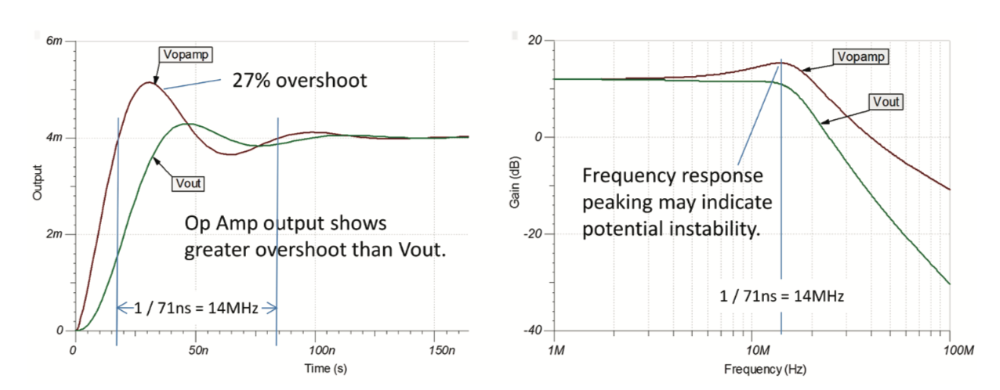
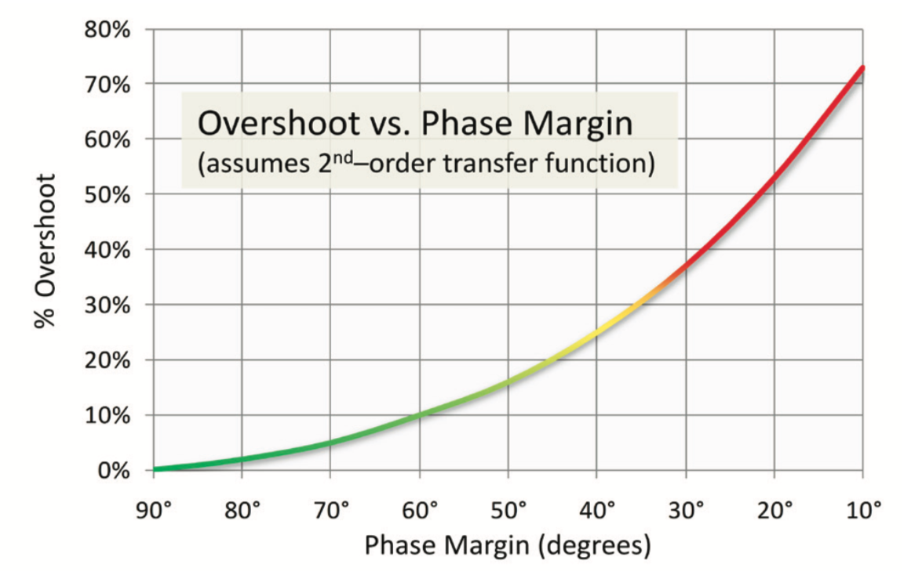

# 运放电路设计要点

[TOC]

## 开环增益

### dB与放大倍数的转换

通常我们查看器件过个会看到一种描述，器件开环增益120dB，那么如何将该增益转化为倍数呢？

首先明确一点开环增益、闭环增益指的都是输出电压与输入电压之比。

计算电压增益倍数：$10^{\frac{120db}{20}}=1000000V/V$

计算电压增益：$20 \times \log_{10} (1000000V/V) = 120dB$

## 电路稳定性

### 过冲VS峰值频率

通过过冲波形计算峰值频率，通过观察时域中信号振铃周期，其倒数就是峰值频率。

图中看到振铃周期为71ns，其倒数1/71ns=14MHz频率，可看到在14MHz位置出现极大的峰化。

### 相位裕量

合理稳定性的普遍接受观点是，电路必须保证45度及以上的相位裕量。45度的裕量相当于电路必须小于20%的过冲。

过冲与相位裕量关系图：

