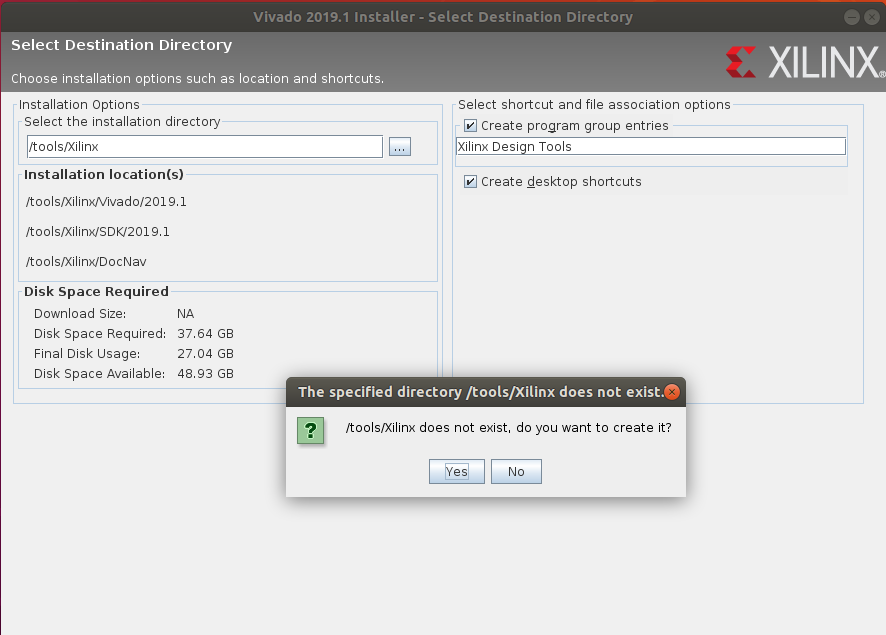

# VIVADO2019.1在UBUNTU18.04下安装

[TOC]

## 环境准备

* 下载ubuntu18.04 ISO

  [ISO下载链接](https://www.ubuntu.com/download/desktop/thank-you?country=CN&version=18.04.2&architecture=amd64#download)
  
* 下载VIVADO 安装文件

  [VIVADO下载](https://www.xilinx.com/support/download.html)

  > 文件下载需要先注册Xilinx 账号
  >
  > 下载文件如：Xilinx_Vivado_SDK_2019.1_0524_1430.tar.gz

## ubuntu 环境准备

### 安装make

```shell
leo@ubuntu:~$ sudo apt-get install make
```


## 安装Vivado

### 解压下载文件

```shell
# 解压
leo@ubuntu:~/Downloads$ tar -xvf Xilinx_Vivado_SDK_2019.1_0524_1430.tar.gz 
# 查阅文件
leo@ubuntu:~/Downloads$ ls -al
total 22426440
drwxr-xr-x  3 leo leo        4096 Jun  2 11:59 .
drwxr-xr-x 16 leo leo        4096 Jun  2 11:45 ..
drwxr-xr-x  8 leo leo        4096 May 25 12:24 Xilinx_Vivado_SDK_2019.1_0524_1430
-rw-r--r--  1 leo leo 22964656463 Jun  2 11:43 Xilinx_Vivado_SDK_2019.1_0524_1430.tar.gz
# 进入解压目录
leo@ubuntu:~/Downloads$ cd Xilinx_Vivado_SDK_2019.1_0524_1430/
# 运行安装文件
leo@ubuntu:~/Downloads/Xilinx_Vivado_SDK_2019.1_0524_1430$ sudo ./xsetup

```
### 选择安装目录



### 安装后设置

带软件安装完毕后，在出现的许可界面，点击导入许可既可以完成设定。


## 启动vivado

* 方法一

  ```shell
  leo@ubuntu:/$ cd /tools/Xilinx/Vivado/2019.1/bin
  leo@ubuntu:/tools/Xilinx/Vivado/2019.1/bin$ ./vivado
  ```
  
* 方法二

  ```shell
  leo@ubuntu:~$ source /tools/Xilinx/Vivado/2019.1/settings64.sh 
  leo@ubuntu:~$ vivado
  ```

  > 为了方便建议使用方法二
  >
  > 当执行一次以上指令后，以后的每次打开软件只需要输入 `vivado`即可


> **注意：**
> 由于安装时使用了超级用户，如果在启动过程出现了权限问题那么需要调整`~/.Xilinx`权限
> `leo@ubuntu:~$ sudo chmod -R 777 .Xilinx/`
> 打开SDK是出现如下提示：
> `Gtk-Message: 14:45:04.520: Failed to load module "canberra-gtk-module”`
> 系统缺少了libcanberra-gtk-module
> `leo@ubuntu:~$ sudo apt-get install libcanberra-gtk-module`

至此VIVADO已经可以运行了。

## 测试VIVADO环境

* 打开范例项目
* 

